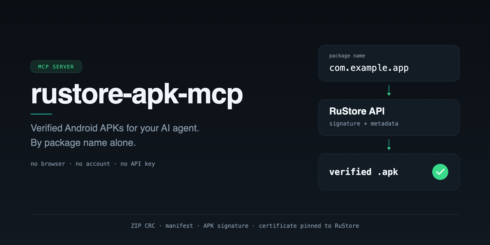

<p align="center">
  
</p>

<h1 align="center">rustore-apk-mcp</h1>

<p align="center">
  <b>Your AI agent says a package name. It gets a signature-verified APK on disk.</b><br>
  No browser automation. No account. No API key.
</p>

<p align="center">
  <a href="https://github.com/kirvigen/rustore-apk-mcp/actions/workflows/ci.yml"></a>
  <a href="#quickstart"></a>
  <a href="https://modelcontextprotocol.io"></a>
  <a href="LICENSE"></a>
  <a href="#verification-what-actually-gets-checked"></a>
  <a href="README.ru.md"></a>
</p>

---

Getting an APK into an agent's workspace is normally a chore: find the listing, fight a
download page, dodge a mirror of unknown provenance, and then just *hope* the file is the
app you asked for. This MCP server removes the whole detour.

```
you  ▸ Download the APK for ru.foodfox.client and tell me where it is.

agent ▸ download_apk(package_name="ru.foodfox.client")
       ↳ /Users/you/Downloads/rustore-apks/ru.foodfox.client-250000235.apk
         version 25.0.0 (250000235) · 84.1 MB
         sha256  b9f4…c1a7
         verified: ZIP CRC, manifest package/version and APK signature
                   verified; certificate matches RuStore
```

One tool call. A real file. A verification chain you can point at.

## Why this exists

| | Typical APK mirror / scraper | `rustore-apk-mcp` |
|---|---|---|
| **Provenance** | "trust the mirror" | RuStore's own API + CDN, nothing else |
| **Integrity** | maybe a checksum | ZIP CRC + manifest + **APK signature** |
| **Identity** | filename says so | `packageName` and `versionCode` read from the manifest |
| **Authenticity** | — | signing cert **pinned** to the SHA-256 RuStore reports |
| **Auth** | login walls, captchas | none — no account, no API key |
| **Mechanism** | headless browser, brittle | plain HTTPS calls |
| **Agent fit** | glue scripts | native MCP tools with output schemas |

## Quickstart

**Requirements:** Python 3.11+, [uv](https://docs.astral.sh/uv/), Java, and Android SDK
Build Tools (`aapt`, `apksigner`). The build tools are auto-discovered from `PATH`,
`ANDROID_HOME`, `ANDROID_SDK_ROOT`, and the standard SDK locations on macOS and Linux.

```sh
git clone https://github.com/kirvigen/rustore-apk-mcp.git
cd rustore-apk-mcp
uv sync --locked
uv run --locked rustore-apk-mcp
```

The server speaks MCP over **stdio**, so an empty prompt after startup is expected —
`stdout` belongs to the protocol.

### Connect it to your agent

<details open>
<summary><b>Codex CLI</b></summary>

```sh
codex mcp add rustore-apk \
  --env APK_MCP_DOWNLOAD_DIR="$PWD/downloads/mcp" \
  -- "$PWD/.venv/bin/rustore-apk-mcp"
```

Then add `tool_timeout_sec = 600` under `[mcp_servers.rustore-apk]` in your Codex config —
large APKs plus signature verification need the headroom.
</details>

<details>
<summary><b>Claude Code</b></summary>

```sh
claude mcp add rustore-apk \
  --env APK_MCP_DOWNLOAD_DIR="$PWD/downloads/mcp" \
  -- "$PWD/.venv/bin/rustore-apk-mcp"
```
</details>

<details>
<summary><b>Any other MCP client</b></summary>

```json
{
  "mcpServers": {
    "rustore-apk": {
      "command": "/absolute/path/to/rustore-apk-mcp/.venv/bin/rustore-apk-mcp",
      "env": {
        "APK_MCP_DOWNLOAD_DIR": "/absolute/path/to/downloads"
      }
    }
  }
}
```

Set the client's per-call timeout to **at least 600 seconds**.
</details>

That's it. A fresh agent needs nothing more than:

> *"Download the APK for `com.example.app` via rustore-apk and give me the path."*

## Tools

### `get_apk_info(package_name)`
Latest release metadata — app name, version name and code, minimum Android SDK, price,
signing certificate, store URL. Read-only, no download.

### `download_apk(package_name, max_mib=1024)`
Downloads and verifies the latest free standalone APK, then returns:

```json
{
  "package_name": "com.example.app",
  "version_name": "1.4.2",
  "version_code": 10402,
  "path": "/abs/path/com.example.app-10402.apk",
  "bytes": 44236800,
  "sha256": "…",
  "certificate_sha256": "…",
  "verification": "ZIP CRC, manifest package/version and APK signature verified; certificate matches RuStore",
  "cached": false
}
```

Calling `download_apk` directly is fine — `get_apk_info` is optional.

## Verification: what actually gets checked

Every byte is checked **before** the file is moved into place. A download that fails any
step never becomes an `.apk` in your directory.

1. **Host pinning** — the CDN URL must be `https://static.rustore.ru`; redirects are not followed.
2. **Declared size** — the stream is cut off the moment it exceeds what the API promised.
3. **ZIP integrity** — CRC of every entry, with a 4 GiB decompression bound against zip bombs.
4. **Identity** — `packageName` and `versionCode` are read from `AndroidManifest.xml` via `aapt`
   and must match the release you asked for.
5. **Signature** — `apksigner verify` must pass.
6. **Certificate pinning** — the signing certificate's SHA-256 must equal the one RuStore
   reports for that listing.

Cached copies are re-verified the same way on every call; a corrupted or mismatched cache
entry is silently re-fetched. Partial files are cleaned up on any failure.

> [!IMPORTANT]
> Signature verification proves the file is **intact and from the same publisher RuStore
> lists** — it is *not* a behavioural or malware analysis. The server never installs or
> executes anything it downloads.

## Limits (the honest list)

- Latest version only; no version history.
- Free apps only — a non-zero price is refused outright.
- Standalone APKs only; split APKs / bundles are not supported yet.
- Listings backed by an external source are refused rather than guessed at.
- Coverage is whatever RuStore's catalogue has.
- The download profile is fixed: Android SDK 36, `arm64-v8a`, 480 dpi, `withoutSplits=true`.
- RuStore's consumer API is not a stable public contract; it can change without warning.
- HTTP 403/429 stops the call immediately, with no retries — call again later.
- Hard ceilings: 5-minute download, `max_mib` bytes, 4 GiB uncompressed for verification.

## Configuration

| Variable | Default |
|---|---|
| `APK_MCP_DOWNLOAD_DIR` | `~/Downloads/rustore-apks` |
| `APK_MCP_AAPT` | auto-discovered `aapt` |
| `APK_MCP_APKSIGNER` | auto-discovered `apksigner` |
| `RUSTORE_VERSION_CODE` | `1000` (sent as the `ruStoreVerCode` header) |

Files are named `<package_name>-<version_code>.apk`.

## Tests

```sh
uv run pytest -q

# Opt-in live check: metadata, download and cache reuse over a real MCP stdio client.
uv run python scripts/smoke_mcp.py com.yolo_price_mobile
```

Last verified end-to-end on 2026-09-09: `com.yolo_price_mobile` 0.9.55 (611).

## Also in this repo

`apk_scrapper.cli` is an earlier, standalone APKPure page-parsing CLI (`apk-scrapper` entry
point). It predates the MCP server, is not used by it, and is kept only for reference — the
MCP tools talk to RuStore and nothing else.

## Contributing

Issues and PRs are welcome — split-APK support and broader catalogue coverage are the two
most useful things anyone could add. Keep the verification chain intact: nothing lands on
disk that hasn't passed every check above.

## References

- [RuStore API schema](https://gist.github.com/oldnomad/5d38a9ea9b1daf9d82fa4f655b9aebe8)
- [MCP Python SDK](https://github.com/modelcontextprotocol/python-sdk)
- [Adding MCP servers to Codex](https://developers.openai.com/codex/mcp)

## License

[MIT](LICENSE)

---

<sub>Not affiliated with, endorsed by, or connected to RuStore or VK. Use it in line with
RuStore's terms and the licence of whatever app you download.</sub>
